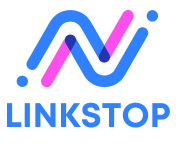

<h1 align="center">
  
</h1>

**LinkStop** is a simple yet powerful VoIP application clone of zoom, utilizng powerful <a style="color: cyan; font-weight: bold; font-size: 15px" href="https://getstream.io/">Getstream-io</a> video & stream api. that allows users to connect through live meetings, share screens, schedule events, and join personal stream meetings via invitation links—similar to Zoom. The app provides a seamless experience for users to collaborate in real time through video and voice calls.

## Inspiration

LinkStop is a lightweight video conferencing and VoIP application built as a similar to platforms like Zoom. I created this project to demonstrate my technical expertise building Dynamic, Interactive and SSR web applications using Nextjs14 while utilizing powerful third-party api providers like getstream-io and clerk.

Note: this project is developed solely for providing free video streaming service and for education purposes. the application is still in development mode.

## Features

- **Live Meetings**: Join or host live meetings with video and voice calls.
- **Screen Sharing**: Share your screen with other participants in real time.
- **Scheduled Meetings**: Schedule meetings in advance and receive notifications.
- **Personal Stream Meetings**: Join personal meetings through unique invitation links.
- **Voice Rooms**: Create voice rooms for more casual audio interactions.

## Technologies Used

- [Next.js14](https://nextjs.org/)
- [Getsteam-io](https://getstream.io/)
- [Clerk](https://clerk.com/)
- [ui-shadcn](https://ui.shadcn.com/)
- [Tailwind CSS](https://tailwindcss.com/)
- [Vercel](https://vercel.com)

## License

Licensed under the [MIT license](https://github.com/shadcn/ui/blob/main/LICENSE.md).
